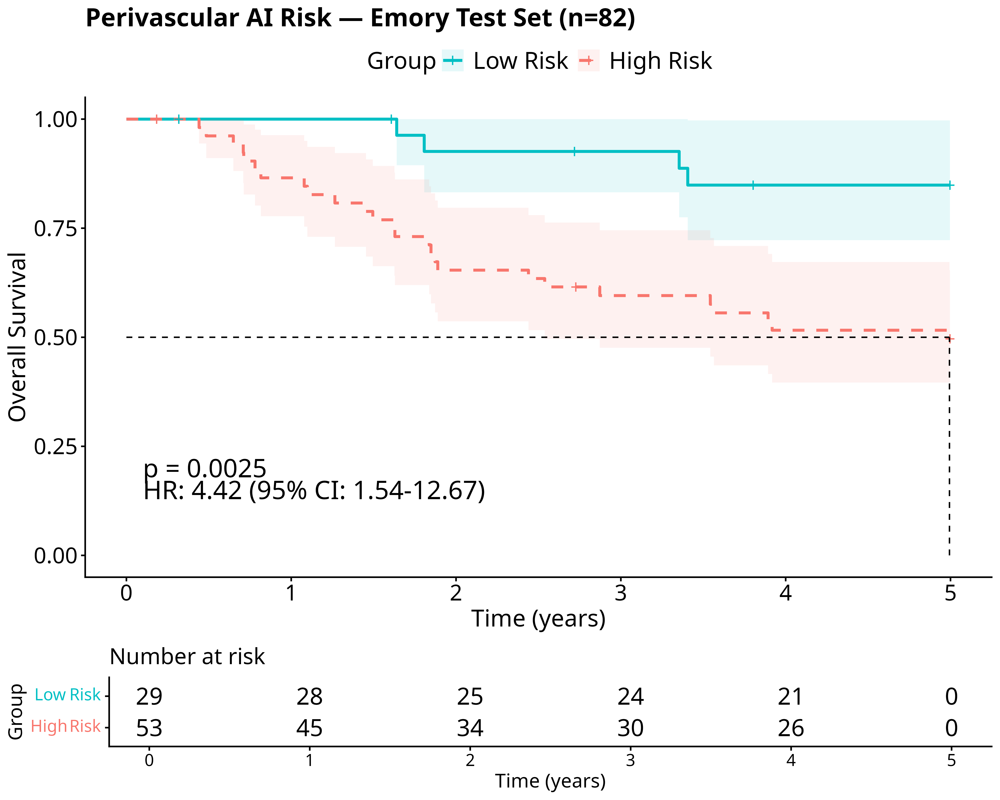
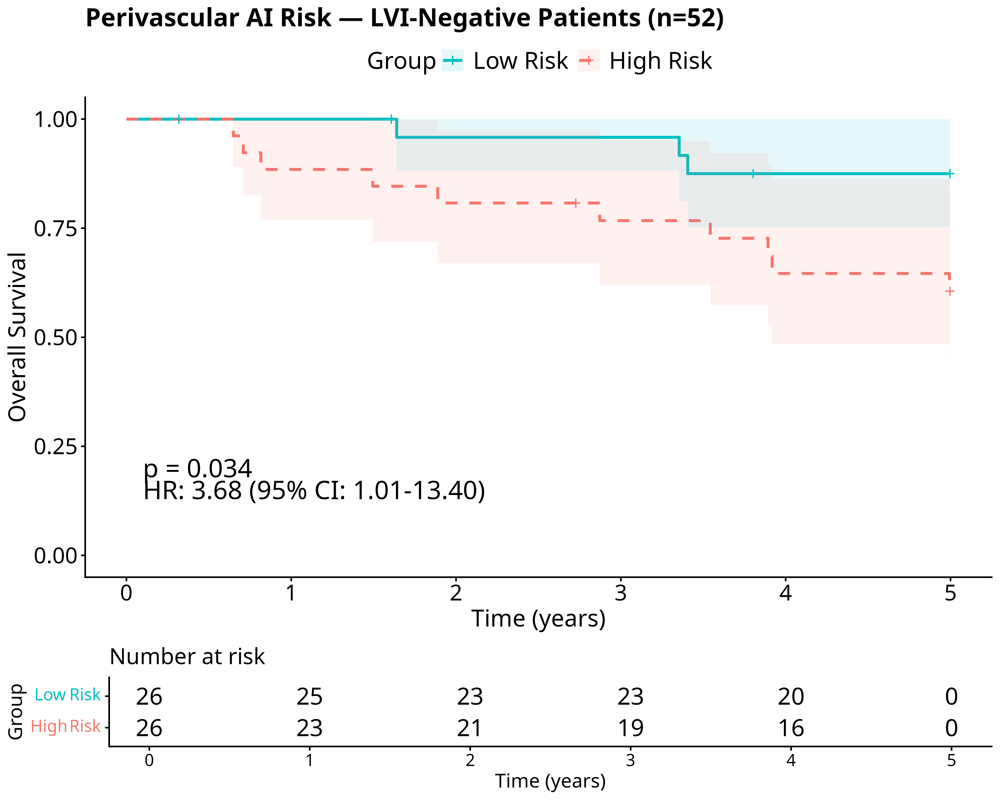
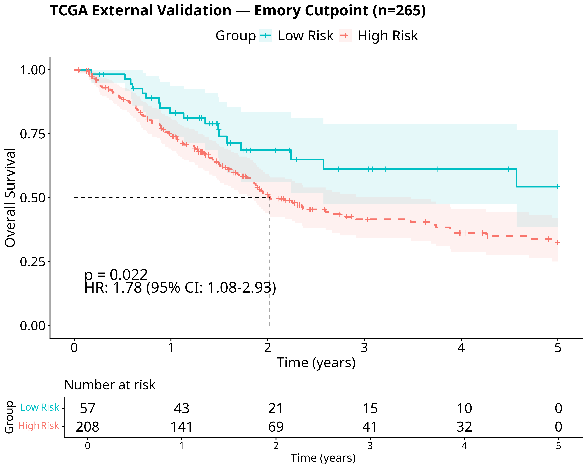
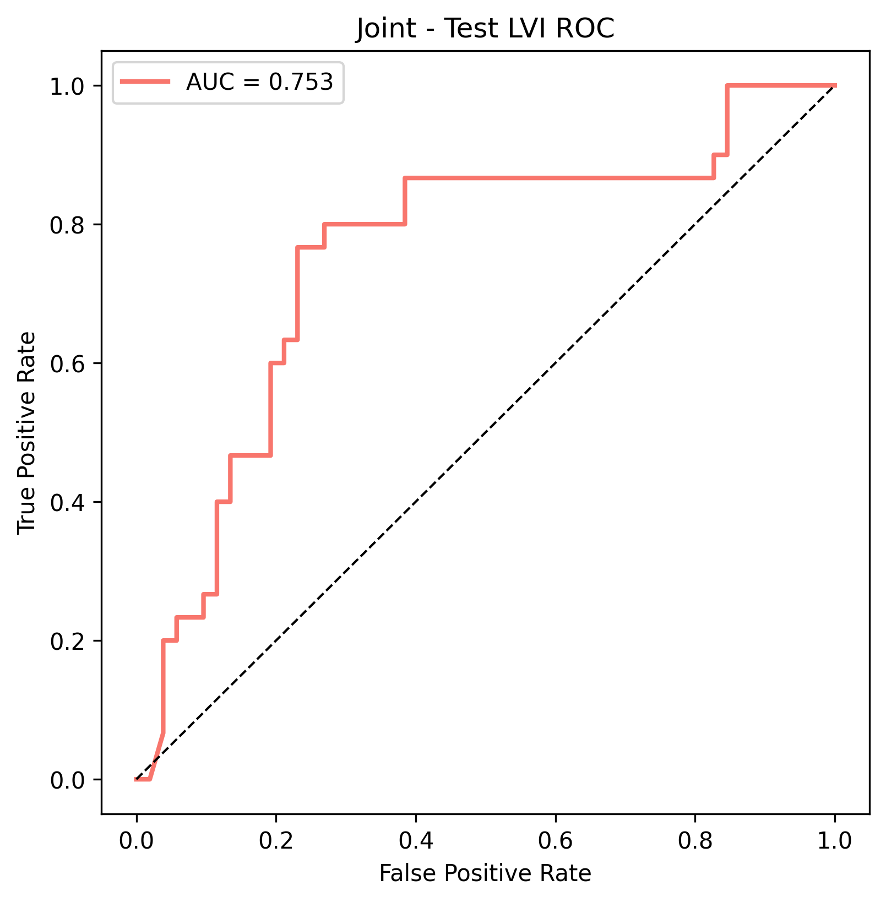
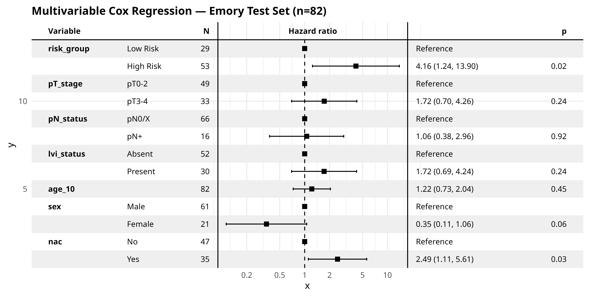
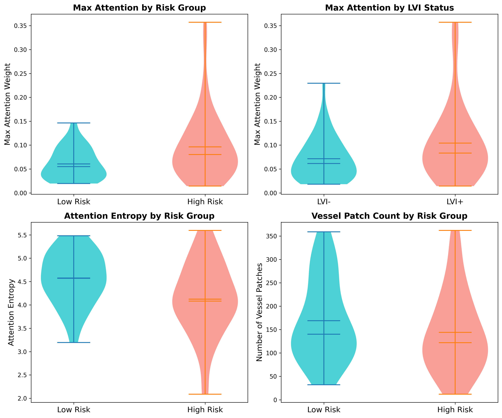
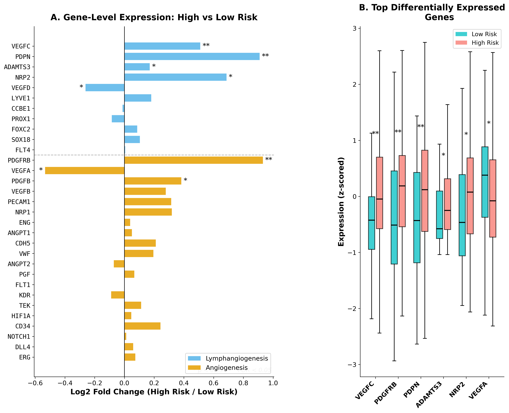
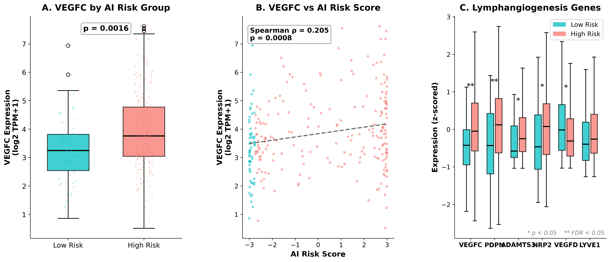

# LVI Prediction from H&E Whole-Slide Images in Bladder Cancer

Predicting lymphovascular invasion (LVI) status and overall survival (OS) from H&E-stained whole-slide images (WSIs) in muscle-invasive bladder cancer (MIBC) using a multi-task deep learning pipeline.

## Approach

```
WSI → YOLO11n vessel detection → bbox-level feature filtering → ABMIL multi-task learning
```

1. **YOLO11n** detects vessel-like structures on 2048×2048 tiles extracted on-the-fly from WSIs
2. **Feature filtering** keeps only CONCH v1.5 patch embeddings near YOLO detections (bbox center-in-box matching + global NMS)
3. **Multi-task ABMIL** jointly predicts LVI (binary) and OS (Cox regression) with a learnable fusion gate and patch-level LVI attention

## Pipeline Structure

```
pipeline/
├── config.py                 # Paths, hyperparameters, device settings
├── dataset.py                # Data loading with confidence-weighted sampling
├── models.py                 # SurvivalModel (joint), SurvivalOnlyModel, LVIOnlyModel
├── train.py                  # Multi-task training (Cox + BCE + sparsity + consistency)
├── evaluate.py               # C-index, AUC, Kaplan-Meier, ROC curves
├── inference_tcga.py         # External validation on TCGA-BLCA
├── export_for_r.py           # Export predictions for R survival analysis
├── heatmaps.py               # ABMIL attention heatmap visualization (trident)
├── visualize.py              # Multi-panel attention heatmap visualization
└── preprocess/
    ├── yolo_predict.py       # On-the-fly YOLO inference on WSI tiles
    ├── filter_h5.py          # Filter CONCH features by YOLO detections
    ├── concat_patient_h5.py  # Merge slide-level features per patient
    ├── prepare_annotations.py # Convert LVI masks → COCO → YOLO format
    └── preprocess_tcga.py    # End-to-end TCGA preprocessing
```

## Model Architecture

The **joint model** (`SurvivalModel`) combines:

- **Patch-level LVI attention**: 8-head multi-head attention on 768-dim CONCH v1.5 features, with a per-patch LVI prediction head
- **Learnable fusion gate**: `nn.Parameter` initialized at 0.2 (sigmoid ≈ 0.55) that blends LVI-weighted and original feature representations
- **Gated ABMIL**: 4-head, 512-dim attention-based MIL for slide-level aggregation
- **Dual output heads**: survival risk score (tanh × 3.0 for Cox) and binary LVI classification

Two ablation models (survival-only, LVI-only) isolate each task's contribution.

### Training Losses

| Loss | Weight | Description |
|------|--------|-------------|
| Cox partial log-likelihood | 1.0 | Survival prediction via `torchsurv` |
| Binary cross-entropy | 0.5 | Patient-level LVI classification |
| Sparsity (entropy) | 0.0 | Disabled after tuning |
| Consistency (L1) | 0.015 | Aligns normalized risk score with LVI probability |

### Analysis Scripts

```
results_2026/results/
├── km_plots.R              # Emory KM curves (main + ablation)
├── km_optimal.R            # Emory KM with 35th pct cutpoint + MVA forest plot
├── km_tcga.R               # TCGA KM curves + MVA
├── subgroup_km.R           # Emory subgroup analyses (LVI-/+, pT, NAC)
├── subgroup_staging.R      # pT3-4, N+/N0 subgroups (Emory + TCGA)
├── mva_forest.R            # Multivariable Cox + forest plots
├── extra_analyses.py       # Attention violin plots + t-SNE
├── rna_angiogenesis.py     # Bulk RNA angiogenesis correlation (TCGA)
├── rna_vascular_analysis.py # Expanded angiogenesis + lymphangiogenesis analysis
```

## Results

### Emory Test Set (n=82)

| Analysis | HR (95% CI) | p-value | C-index |
|----------|-------------|---------|---------|
| Univariable | 4.42 (1.54–12.67) | 0.006 | 0.641 |
| Multivariable* | 4.16 (1.24–13.90) | 0.021 | 0.752 |

*Adjusted for pT stage, pN status, LVI, age, sex, NAC



**Key subgroup**: LVI-negative patients (n=52): HR=3.68, p=0.034 — model identifies high-risk patients even when pathologist-assessed LVI is absent.



### TCGA External Validation (n=265)

| Analysis | HR (95% CI) | p-value | C-index |
|----------|-------------|---------|---------|
| Univariable | 1.78 (1.24–2.54) | 0.002 | 0.609 |
| Multivariable* | 1.46 (1.01–2.10) | 0.044 | 0.646 |

*Adjusted for AJCC stage, age, sex



**Ablation study**: Joint model (C=0.609) outperforms Survival-Only (C=0.569, p=0.068) and LVI-Only (C=0.516, p=0.90).

### LVI Classification



AUC = 0.753 on the Emory test set.

### Multivariable Analysis



AI risk group remains significant (HR=4.16, p=0.021) after adjusting for pT stage, pN status, LVI, age, sex, and neoadjuvant chemotherapy.

### Attention Analysis



High-risk patients show higher max attention weights and more concentrated attention (lower entropy), consistent with the model focusing on specific vessel-adjacent regions.

### RNA Vascular Gene Expression (TCGA)



Gene-level differential expression analysis of 31 angiogenesis and lymphangiogenesis genes between AI risk groups. Three genes survive FDR correction: **VEGFC** (lymphatic growth factor, FDR=0.038), **PDPN** (podoplanin, lymphatic marker, FDR=0.039), and **PDGFRβ** (pericyte marker, FDR=0.038).



VEGFC expression is significantly elevated in high-risk patients (p=0.0016) and positively correlated with AI risk score (Spearman ρ=0.205, p=0.0008). The VEGFC→lymphangiogenesis axis (VEGFC, PDPN, ADAMTS3, NRP2) is coherently upregulated, providing biological validation that the model captures lymphovascular biology.

## Workflow

### 1. Preprocessing

**YOLO vessel detection** (on-the-fly, no tile images saved to disk):
```bash
python -m pipeline.preprocess.yolo_predict \
    --wsi_dir /path/to/wsi_images \
    --patches_h5_dir /path/to/trident_patches_h5 \
    --output_dir yolo_predictions/emory \
    --batch_size 64
```

**Filter features** by YOLO detections (global NMS + center-in-box):
```bash
python -m pipeline.preprocess.filter_h5 \
    --features_dir /path/to/conch_features \
    --patches_h5_dir /path/to/trident_patches_h5 \
    --yolo_dir yolo_predictions/emory \
    --output_dir /path/to/filtered_features
```

**Concatenate per patient** (merge multi-slide patients):
```bash
python -m pipeline.preprocess.concat_patient_h5 \
    --input_dir /path/to/filtered_features \
    --output_dir /path/to/patient_level_features \
    --clinical_csv clinical_data_emory_mibc_lvi_os.csv
```

### 2. Training

```bash
# Joint multi-task model (recommended)
python -m pipeline.train --model joint

# Full ablation study (joint + survival-only + LVI-only)
python -m pipeline.train --model ablation
```

### 3. Evaluation

```bash
python -m pipeline.evaluate
```

Produces: C-index, LVI AUC, Kaplan-Meier curves, ROC curves, and ablation comparison table in `results/`.

### 4. TCGA External Validation

```bash
# Preprocess TCGA (YOLO + filter in one step)
python -m pipeline.preprocess.preprocess_tcga

# Run inference
python -m pipeline.inference_tcga
```

### 5. Export for R Analysis

```bash
python -m pipeline.export_for_r
```

Exports `survival_data_for_R.csv` and `clinical_merged_{emory,tcga}_final.csv` for multivariate Cox regression and forest plots in R.

### 6. Attention Heatmaps

```bash
# Multi-panel heatmap (H&E + YOLO boxes + LVI probability + ABMIL attention + top-k patches)
python -m pipeline.visualize --patient_id 577-3428

# With top-k patch crops saved separately
python -m pipeline.visualize --patient_id 577-3428 --save_topk 5

# With larger context crops (4096px) centered on top-k patches
python -m pipeline.visualize --patient_id 577-3428 --save_topk 5 --context_size 4096
```


Multi-panel visualization showing each layer of the model's decision process: raw H&E tissue, YOLO vessel detections, per-patch LVI probability from the MHA head, and ABMIL slide-level attention.

## Data

| Cohort | Patients | Slides | LVI+ | OS Events |
|--------|----------|--------|------|-----------|
| Emory (train) | 81 | 152 | 27 | 36 |
| Emory (test) | 82 | 152 | 27 | 37 |
| TCGA-BLCA | 265 | 352 | N/A | 137 |

- **Features**: 768-dim CONCH v1.5 embeddings extracted at 20× magnification, 512px patches
- **Sampling**: 512 patches per patient during training (multinomial by YOLO confidence)
- **Censoring**: 5-year (1825 days)
- **Risk cutpoint**: 35th percentile of training set risk scores

## Dependencies

Requires the `trident` conda environment:

- PyTorch (with CUDA)
- Ultralytics (YOLO11n)
- h5py, openslide-python
- torchsurv, lifelines
- scikit-learn, pandas, numpy, matplotlib
- trident (slide encoders, tissue segmentation)

## Setup

```bash
conda activate trident
```

All paths are configured in `pipeline/config.py`.
